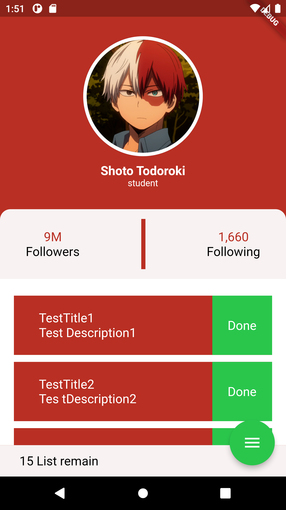
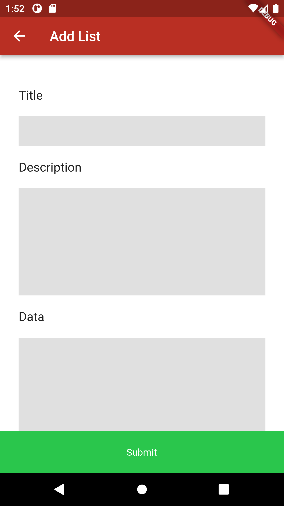
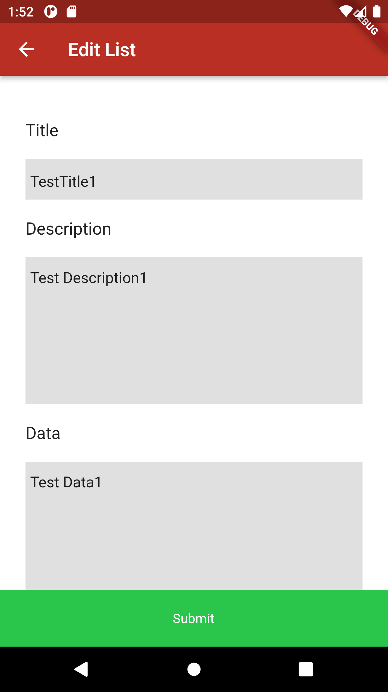

# Flutter project

> ## **Flutter API** 
---

- `Get`
- `Post`
- `Put`
- `Delete`
---
> ## **with Package**
---
- `json_annotation`
- `json_serializable`
- `build_runner`
- `dio`

---
> ### _การทำงานของแอปพลิเคชัน_ 
---

     - การดึง API มาแสดง
     - การเพิ่มข้อมูล
     - การแก้ไขข้อมูล
     - การลบข้อมูล
       
---
> ### _รูปลักษณ์ภายในแอปพลิเคชัน_
---
- [1] หน้าจอแสดงข้อมูล `จะทำการลบเมื่อกดปุ่ม` _Done_ 

---
- [2] หน้าจอเพิ่มข้อมูล

---
- [3] หน้าจอแก้ไขข้อมูล

---